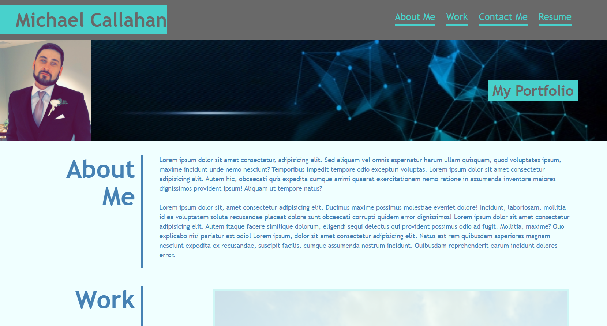

# React Portfolio

## Table of Contents

- [Description](#description)
- [Screenshot](#screenshot-of-working-application)
- [License](#license)
- [Questions](#questions)

## Description

An application created with React to showcase my coding portfolio to potential employers. The portfolio includes overviews of various projects I've completed with links to their corresponding deployed web applications that I've created, ways to contact me, and an about me section.

Link to Deployed Application: [https://mcall0147.github.io/react-portfolio/](https://mcall0147.github.io/react-portfolio/)

### Screenshot of Working Application

## License

This project is licensed under the [MIT License](https://opensource.org/licenses/MIT).

## Questions

If you have any questions about the repo, open an issue or contact me directly:

- Please contact me directly at my [GitHub](https://github.com/mcall0147)
- Or contact me by email at [mcallahanx93@gmail.com](mailto:mcallahanx93@gmail.com)
